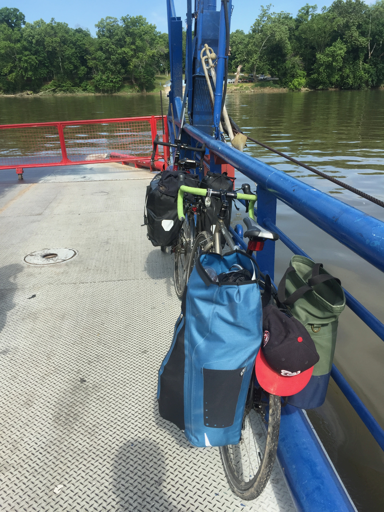

The most expensive purchased I have made in my life (measured in dollars, time, pain, joy, and sweat) is my [Bianchi Lupo Bicylce](http://www.bianchiusa.com/bikes/road/all-road/lupo/)){:target="_blank"}. It has brought me to work, and I have taken her out on joy rides ( SF 2 Cupertino, Fall Foliage Ride in the Appalachians, DC 2 Baltimore, etc... ) but I had yet to load her with gear and camp overnight.

Enter bike guru and friend of the site [Max Jay Richman](http://richmanmax.com/){:target="_blank"}, who proposed a late spring route up the C&O Canal and back on the W&OD trail.

Day One started at the Canal Trail's entrance in Georgetown with a 33 mile bike ride to [Turtle Run Campsite](https://www.canaltrust.org/pyv/turtle-run-campsite/){:target="_blank"}, a free biker/hiker campsite maintained by the C&O trust.  See the ride on strava!

<iframe height='405' width='95%' frameborder='0' allowtransparency='true' scrolling='no' src='https://www.strava.com/activities/1018160504/embed/9fabdf1718c8b1c4afb24af683114ebc7d4dea4c'></iframe>

Day Two had us crossing the mighty Potomac at [White's Ferry](http://www.poolesvillemd.gov/338/Whites-Ferry){:target="_blank"}

[
